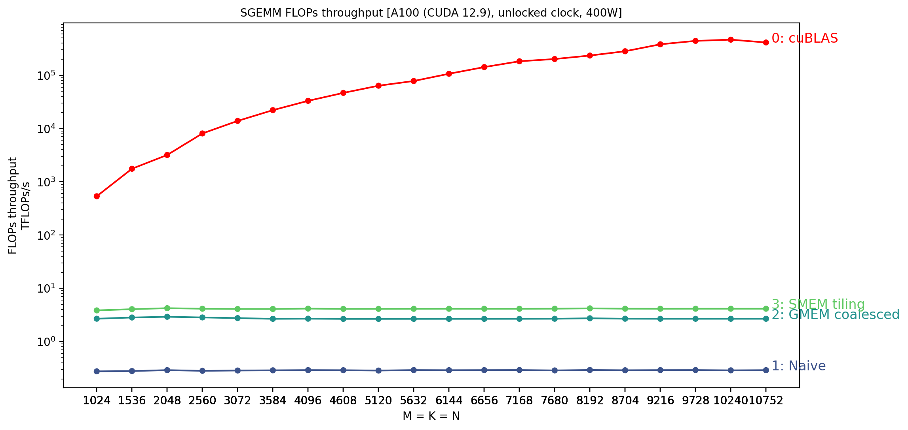

# SGEMM

Accompanying repo for the blog post: https://tushaargvs.github.io/posts/matmul.html.

> This repo was adapted from:
>
> - https://github.com/salykova/sgemm.cu,
> - https://github.com/siboehm/SGEMM_CUDA, and
> - https://github.com/wangzyon/NVIDIA_SGEMM_PRACTICE.

Running on a single A100 GPU:



FLOPS throughput (TFLOPs/s) for SGEMM with matrices of size `M = K = N = 8192`:

|       Kernel        | FLOPS throughput (TFLOPs/s) | Relative to cuBLAS |
| :-----------------: | :-------------------------: | :----------------: |
|     0.0: cuBLAS     |          2.345e+05          |      100.000%      |
|     1.0: Naive      |          2.935e-01          |       0.000%       |
| 2.0: GMEM coalesced |          2.743e+00          |       0.001%       |
|  3.0: SMEM tiling   |          4.212e+00          |       0.002%       |

## Installation

Install dependencies in `env.yml`:

```shell
# Create and activate a new env called `sgemm-env`.
conda env create -f env.yml
# If already created, update the env (and remove unused packages).
conda env update -f env.yml
conda activate sgemm-env

# Ensure that the installation was successful by checking the CUDA version.
nvcc --version
# Also, check to make sure all cuda-related packages are installed.
```

If you wish to delete the `sgemm-env` environment, run:

```shell
conda remove -n sgemm-env --all
```

## Running

Build the project and run it:

```shell
make [VERBOSE=1] [-B] build 2> err.log
[DEVICE=<device-idx>] ./sgemm <kernel-num> 2> err.log
```

To profile a kernel, run:

```shell
make profile KERNEL=<kernel-num> 2> err.log
```

To benchmark all kernels, run:

```shell
make bench [KERNEL=<kernel-num1>,<kernel-num2>,...] 2> err.log
```

### Troubleshooting

<details>
<summary>
    NVCC warning: incompatible redefinition for option <code>compiler-bindir</code>
</summary>
<br/>
This warning means that multiple values for <code>-ccbin</code> 
(= <code>--compiler-bindir</code>) were passed to <code>nvcc</code>. You can verify if 
this is the case by running:
<pre>
# Run `touch dummy.cu` to create an empty file, if needed.
nvcc -v -x cu -c dummy.cu -o /dev/null 2>&1 | grep -Ei "ccbin|compiler-bindir"
</pre>
If you see multiple values for <code>-ccbin</code>, you can try to remove the 
duplicate values by running:
<pre>
export NVCC_PREPEND_FLAGS=" -ccbin=<path-to-compiler>"
</pre>
</details>

<details>
<summary>
    <code>ERR_NVGPUCTRPERM</code>: Permission issue
</summary>
<br/>
You might need sudo access to run <code>ncu</code> since it accesses the GPU Performance
Counters. For more info, see:
<a href="https://developer.nvidia.com/nvidia-development-tools-solutions-err_nvgpuctrperm-permission-issue-performance-counters">
developer.nvidia.com/nvidia-development-tools-solutions-err_nvgpuctrperm-permission-issue-performance-counters</a>.
</details>
